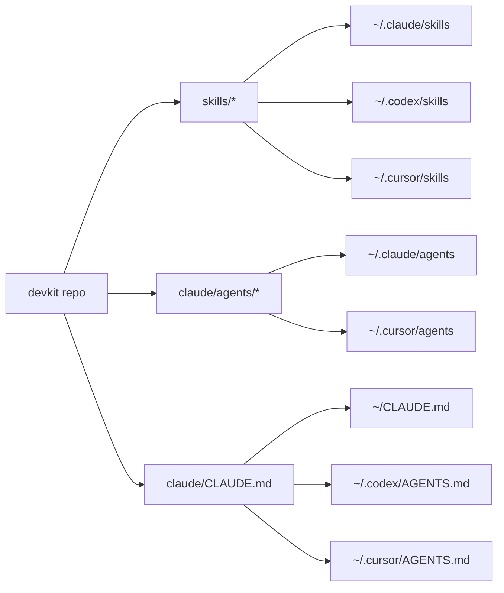

# Devkit

[](#license)
[](#ai-coding-config)
[](#platform-support)

Devkit is a portable setup kit for a modern development machine and a shared AI coding workflow. It bootstraps common CLI tooling, then installs the same reusable instructions, skills, and subagents across Claude Code, Codex, and Cursor.

It is designed around one simple idea: keep your AI coding habits in source control, then symlink them into each tool instead of copying slightly different versions around your machine.



This repository is not affiliated with Anthropic, OpenAI, Cursor, or Anysphere. It is a personal toolkit that may be useful as a starting point for your own setup.

## What It Does

Devkit has two layers:

| Layer | Script | Purpose |
|-------|--------|---------|
| Machine bootstrap | `./bootstrap.sh` or `./setup.sh` | Installs Homebrew, shell tooling, Git, Node, Python, Docker, CLI utilities, and selected AI coding tools |
| AI coding config | `node install.js` | Symlinks shared instructions, skills, and subagents into Claude Code, Codex, and/or Cursor |

During setup, Devkit asks:

- Whether you only want AI coding related tools and config
- Which AI coding environments to install or configure: Claude Code, Codex, Cursor
- Which config package mode to use: minimal, full, categories, or manual

Model selection is intentionally excluded. Choose models inside each tool on each machine.

## Quick Start

### Complete Setup

Use this on a new machine or a machine you want Devkit to manage end to end.

```bash
git clone https://github.com/Levezze/devkit.git ~/devkit
cd ~/devkit
./setup.sh
```

### Bootstrap Only

Use this when you want machine tooling plus the option to install AI coding config.

```bash
./bootstrap.sh
```

### AI Coding Config Only

Use this when Node is already installed and you only want the Claude Code, Codex, and/or Cursor configuration.

```bash
npm install
node install.js
```

## What Gets Installed

### Machine Tools

| Category | Tools |
|----------|-------|
| Shell | Zsh, Oh-My-Zsh, Powerlevel10k |
| Package manager | Homebrew |
| Version control | Git, GitHub CLI |
| JavaScript | Node.js via nvm, pnpm |
| Python | Python 3 |
| Containers | Docker |
| CLI utilities | curl, wget, jq, tree, htop, ripgrep, fd, bat, eza, carapace, atuin |
| AI coding | Claude Code, Codex CLI, Cursor |

Each component checks whether it is already installed and prompts before reinstalling.

### AI Coding Config

| Type | Installed to |
|------|--------------|
| Global instructions | `~/CLAUDE.md`, `~/.codex/AGENTS.md`, `~/.cursor/AGENTS.md`, `~/.cursor/CLAUDE.md` |
| Claude settings | `~/.claude/settings.json`, `~/.claude/settings.local.json`, `~/.mcp.json` |
| Skills | `~/.claude/skills/<name>`, `~/.codex/skills/<name>`, `~/.cursor/skills/<name>` |
| Subagents | `~/.claude/agents/<name>.md`, `~/.cursor/agents/<name>.md` |
| Optional shell config | `~/.zshrc` |

Settings files that need placeholder substitution are copied. Instructions, skills, and subagents are symlinked back to this repo.

Skills can opt into a Devkit model-tier hint:

```yaml
x-devkit-model-tier: highest
```

For generated Codex metadata, Devkit appends a highest-tier instruction to the skill prompt. For tools that load `SKILL.md` directly, put the same expectation in the skill body. Provider-native enforcement differs by tool, so this field is a portable policy hint rather than a universal hard guarantee.

When `/sync-skills` touches model-tier behavior, it must first check current official provider documentation. It should never infer the strongest Claude, OpenAI/Codex, or Cursor model from stale model knowledge, and it should stop rather than downgrade or hard-code a model it cannot verify.

For Claude Code, high-tier skills can also use native skill frontmatter:

```yaml
model: best
effort: xhigh
```

As of the current Claude Code docs, `best` resolves to the most capable available model and is currently equivalent to `opus`; on Anthropic API, `opus` resolves to Opus 4.7 on Claude Code v2.1.111 or later. `xhigh` is the recommended default effort level for Opus 4.7. Use `max` only when you deliberately want unconstrained deeper reasoning for the current session.

## Source Of Truth

The repo layout is intentionally small:

```text
devkit/
  skills/              # Shared SKILL.md files and Codex openai.yaml files
  claude/
    CLAUDE.md          # Shared global instruction source
    settings.json
    settings.local.json
    mcp.json
    agents/            # Claude/Cursor subagent definitions
    plugins/
  shell/
  src/                 # Installer implementation
  scripts/smoke.sh     # Filesystem contract smoke test
```

Because skills are symlinked as whole directories, adding `examples.md`, `scripts/`, or other supporting files under `skills/<name>/` makes them immediately available to every selected tool after installation.

If you move the checkout, rerun `node install.js` so the symlinks point at the new path.

## Included Agents

| Agent | Purpose |
|-------|---------|
| `git-master` | Commits, PRs, and version control workflows without AI watermarks |
| `code-reviewer` | Read-only code quality review |
| `testing-wizard` | Test execution and coverage analysis |
| `documentation-scholar` | Technical documentation writing |
| `api-planner` | API research and integration planning |
| `senior-interviewer` | Mock technical interviews |

## Included Skills

| Skill | What it does |
|-------|--------------|
| `/ask` | Answer questions without writing code |
| `/ddd` | Design-Driven Development visual verification for UI work |
| `/document` | Generate technical documentation via `documentation-scholar` |
| `/documentation-pass` | Audit and update docs after meaningful codebase change |
| `/e2e-playwright-test` | Run an LLM-guided Playwright smoke test |
| `/evaluate` | Review an implementation and quiz the tradeoffs |
| `/fix-pr-review` | Reconcile external PR reviews with your own review and apply warranted fixes |
| `/git-commit` | Stage and commit changes with conventional commit messages |
| `/grill-me` | Stress-test a plan through a structured interview |
| `/handoff` | Write a handoff document for another team, repo, or agent |
| `/improve-codebase-architecture` | Find module-deepening architecture improvements |
| `/pr` | Create a clean pull request description and PR |
| `/pr-review` | Run a diligent end-of-cycle PR review |
| `/prd-to-issues` | Break a PRD into vertical-slice GitHub issues |
| `/review-code` | Review code quality and testing risk |
| `/sync-skills` | Audit and repair Claude Code, Codex, and Cursor skill synchronization |
| `/tdd` | Build with a red-green-refactor loop |
| `/ubiquitous-language` | Extract a DDD-style domain glossary |
| `/write-a-prd` | Interview, explore, and write a product requirements document |

## Updating

```bash
cd ~/devkit
git pull
./setup.sh          # Full update
# or
node install.js     # AI coding config only
```

Choose "Overwrite all remaining" if you want the installer to refresh every managed file.

## Testing The Installer

The smoke test runs the installer against a temporary `HOME` and verifies the filesystem contract: symlinked skill directories, Cursor agents, copied settings, idempotency, and valid skill frontmatter.

```bash
./scripts/smoke.sh
```

## Customizing

### Add A Skill

1. Create `skills/<skill-name>/SKILL.md`.
2. Write a clear first sentence in the frontmatter `description`; that sentence becomes the generated Codex summary.
3. Add `x-devkit-model-tier: highest` only for skills that should request the strongest available model/reasoning tier.
4. Run `/sync-skills` or `node scripts/sync-skills.js --apply`.
5. Run `node install.js` if you need to reinstall the managed symlinks on this machine.

`node install.js` discovers `skills/*/SKILL.md` automatically and regenerates `agents/openai.yaml` from the frontmatter description when needed.

### Add An Agent

1. Create `claude/agents/<agent-name>.md`.
2. Add Claude and Cursor targets in `src/packages.js`.
3. Run `node install.js`.

### Add A Bootstrap Component

Add a new `install_*` function in `bootstrap.sh`, then call it from `main`.

## MCP Servers

After installation, see `CLAUDE_INSTRUCTIONS.md` for optional MCP setup notes, including context7, exa, puppeteer, and sequential-thinking.

## Platform Support

- macOS, Intel and Apple Silicon
- Linux
- WSL2

Cursor auto-install is currently macOS-only through Homebrew Cask. On Linux or WSL2, install Cursor manually and then run `node install.js`.

## Credits

Some skills were adapted from [Matt Pocock's skills collection](https://github.com/mattpocock/skills) under the MIT license, including:

- `/grill-me`
- `/write-a-prd`
- `/prd-to-issues`
- `/ubiquitous-language`
- `/improve-codebase-architecture`
- `/tdd`

## License

MIT
